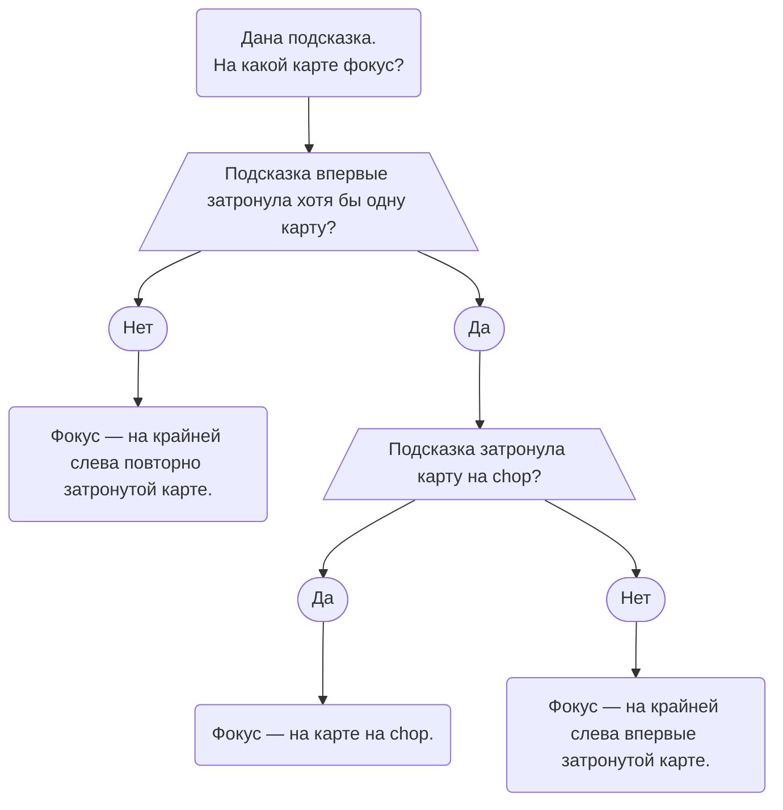

- Материал 1-го уровня можно изучать даже без опыта в Hanabi: либо до первой партии, либо после нескольких игр, когда уже понятна базовая механика.
- Большая часть материала повторяет Руководство для начинающих, но здесь те же правила сформулированы немного подробнее.
- Если Руководство для начинающих ещё не прочитано, **ОСТАНОВИТЕСЬ СЕЙЧАС** и сначала прочитайте его. Возвращайтесь сюда только после 5–10 партий: эта страница предназначена как справочник для игроков, которые уже прочитали Руководство для начинающих.

## Конвенции {/* #conventions */}

### Chop {/* #the-chop */}

- Когда игроку нужно сбросить карту, обычно он сбрасывает крайнюю справа карту без подсказки.
- Формально _chop_ игрока — **следующая карта без подсказки, которую он сбросил бы, если бы ему больше нечего было делать**.
- Если у игрока есть карта с подсказкой, о которой уже известно, что она бесполезна, обычно сначала сбрасывают именно эту бесполезную карту, а не chop. При этом бесполезная карта **не становится chop**: chop по-прежнему остаётся крайней справа картой без подсказки.

### Играбельность (Playable) {/* #the-definition-of-playable */}

- _Играбельность (Playable)_ — свойство карты. Для начала полезно помнить раздел _Delayed Play Clues_ из Руководства для начинающих.
- Когда мы говорим, что карта без подсказки сейчас **играбельна**, это не обязательно означает, что её можно положить на стол прямо в эту секунду. На практике это означает, что на эту карту было бы допустимо дать либо _Play Clue_, либо _Delayed Play Clue_.
- Иными словами, если такой карте дать _Delayed Play Clue_, она в итоге будет сыграна **без каких-либо дополнительных подсказок**: все необходимые промежуточные карты уже находятся в нужных руках и учтены в момент, когда даётся исходная _Play Clue_.

### Мусор (Trash) {/* #the-definition-of-trash */}

- **Мусор (Trash)** — свойство карты. Карта считается мусором, если она уже никогда не сможет быть сыграна на стол или если две либо больше копий этой карты уже имеют подсказки.
- Поскольку мы следуем _Good Touch Principle_, команда намеренно старается не затрагивать мусорные карты подсказками. На более высоких уровнях появятся специальные ситуации, где намеренно затронуть мусор всё же бывает выгодно.
- В редких случаях одна и та же карта может одновременно быть и **играбельной**, и **мусорной**.

### Save Clues {/* #save-clues */}

- _Save Clue_ разрешено давать **только карте на chop**.
  - Поэтому если подсказка фокусируется на карте **не на chop**, она обязана быть _Play Clue_.
- Нельзя давать _Save Clue_ любой карте, которую просто хочется сохранить. На 1-м уровне это допустимо только для следующих категорий:
  1. 5 — подсказкой числом 5, то есть через _5 Save_;
  2. 2 — подсказкой числом 2, то есть через _2 Save_;
  3. критических карт — подсказкой по цвету или по числу.
- Кроме того, вся группа договаривается никогда не позволять сбросить **уникальную играбельную карту**. Однако подсказка такой карте по определению является _Play Clue_, а не _Save Clue_.

### Фокус подсказки (Clue Focus) {/* #clue-focus */}

Фокус подсказки (Clue Focus) определяется четырьмя правилами по порядку:

1. Если подсказка не затрагивает впервые ни одной карты — фокус находится на **крайней слева повторно затронутой карте**.
2. Если подсказка впервые затрагивает ровно одну карту — фокус находится на ней.
3. Если подсказка впервые затрагивает две или больше карт и среди них есть chop — фокус находится на chop.
4. Если подсказка впервые затрагивает две или больше карт и chop не затронут — фокус находится на **крайней слева впервые затронутой карте**.

Эти правила представлены на схеме ниже:

### Good Touch Principle {/* #good-touch-principle */}

- См. раздел [_Good Touch Principle_](./beginner/good-touch-principle.mdx) в Руководстве для начинающих.

### Save Principle {/* #save-principle */}

- См. раздел [_Save Principle_](./beginner/save-principle.mdx) в Руководстве для начинающих.

### Minimum Clue Value Principle {/* #minimum-clue-value-principle */}

- См. раздел [_Minimum Clue Value Principle_](./beginner/minimum-clue-value-principle.mdx#no-nonsense-clues) в Руководстве для начинающих.

### Early Game {/* #the-early-game */}

- _Early Game_ — период партии до того момента, когда кто-либо впервые сбросит свою chop-карту.
- До окончания _Early Game_ игроки **обязаны «исчерпать» все доступные Play Clues и Save Clues** на столе: если такую подсказку ещё допустимо дать, нельзя просто инициировать _Mid-Game_ сбросом chop.
  - Как объясняется в Руководстве для начинающих, «исчерпать все Play Clues» **не означает** дать все возможные _Tempo Clues_. Обычная _Tempo Clue_ не удовлетворяет _Minimum Clue Value Principle_, поэтому без специальной причины её давать не следует.
- На 9-м уровне появляются дополнительные правила для _Early Game_. Если вы пока играете только на 1-м уровне, о них можно не беспокоиться.

## Специальные приёмы {/* #special-moves */}

### 5 Save {/* #the-5-save */}

- _5 Save_ — это подсказка числом 5, которая впервые затрагивает 5 без подсказки на chop другого игрока. Команда заранее договаривается читать такой ход как _Save Clue_, а не как _Play Clue_.
- По определению _5 Save_ делается **только подсказкой по числу 5**. Если 5 без подсказки впервые затронута подсказкой по цвету, такая подсказка рассматривается как _Play Clue_, а не как _5 Save_.

### 2 Save {/* #the-2-save */}

- _2 Save_ — это подсказка числом 2, которая впервые затрагивает 2 без подсказки на chop другого игрока. Команда заранее договаривается читать такой ход как _Save Clue_, а не как _Play Clue_.
- По определению _2 Save_ делается **только подсказкой по числу 2**. Если 2 без подсказки впервые затронута подсказкой по цвету, это будет _Play Clue_.
  - Исключение — если другая копия этой 2 уже лежит в стопке сброса. Тогда подсказка по цвету оставшейся копии будет _Critical Save_. Но такой ход всё равно **не классифицируется как 2 Save**.

#### Visible Rule {/* #the-visible-rule */}

- Игрокам **запрещено** делать _2 Save_ для 2, если другая копия той же 2 видна в руке другого игрока.

#### Double Chop 2's {/* #double-chop-2s */}

- Исключение из _Visible Rule_ возникает, когда одинаковые 2 одновременно лежат на chop у двух игроков. В этом случае разрешено сделать _2 Save_ любой из них. Если это происходит в _Early Game_, команда **обязана** сохранить одну из них до того, как даст _5 Stall_ или сбросит карту, чтобы начать _Mid-Game_.

### Prompt {/* #the-prompt */}

- _Prompt_ — это ситуация, когда подсказка заставляет игрока сыграть карту с уже имеющейся подсказкой, точное значение которой до этого оставалось неизвестным.
- Если игрок **и без новой подсказки уже собирался сыграть эту карту**, это не _Prompt_. _Prompt_ применяется только к карте, которую без этой подсказки сейчас не собирались разыгрывать.
- Если игрока _Prompted_ и в его руке подходит несколько карт с подсказками, он играет **крайнюю слева** подходящую карту.
- Подробный пример _Prompt_ есть в Руководстве для начинающих.
- На 5-м уровне к этому правилу добавляется раздел _Prompts in Multi-Color Variants_.

### Finesse {/* #the-finesse */}

- _Finesse_ — это ход, который заставляет игрока вслепую сыграть карту, чтобы выполнить обещание, что определённая другая карта уже является играбельной.
- Подробная механика _Finesse_ разобрана в Руководстве для начинающих.
- _Finesse_ должен проходить через **связующую (connecting)** карту. Например, красная 1 непосредственно ведёт к красной 2, поэтому эти две карты образуют связующую пару.
- Когда игрок получает _Finesse_, он должен выполнить ожидаемый blind-play **сразу**, тем самым показывая команде, что понял связь.

### Finesse Position {/* #finesse-position */}

- _Finesse Position_ игрока — слот, в котором находится его **крайняя слева карта без подсказки**.
- На 5-м уровне это определение усложняется из-за _Queued Finesse_.
  - При _Queued Finesse_ в некоторых ситуациях карта без обычной подсказки уже считается фактически «полученной», поэтому простого правила «крайняя слева карта без подсказки» становится недостаточно.

### Finessed-карты {/* #finessed-cards */}

- Хотя _Finessed-карта_ формально остаётся без подсказки, её полезно мысленно считать картой с **невидимой подсказкой**, потому что команда уже «получила» её через _Finesse_.
- Поэтому если новая подсказка затрагивает одновременно _Finessed-карту_ и другую карту, которая до этого вообще не имела подсказки, фокус уходит на **другую, действительно новую карту**: по правилам фокуса новая информация имеет приоритет над картой, которая уже была получена через Finesse.

### Prompts > Finesses {/* #prompts--finesses */}

- **Prompts всегда имеют приоритет над Finesses.**
- Например, если Алиса должна выбрать между:
  1. розыгрышем карты в своей руке, на которой уже есть красная подсказка;
  2. blind-play потенциальной красной карты из своей _Finesse Position_;
- Алиса всегда сначала играет **карту с подсказкой**. Только если подходящей Prompted-карты нет, она рассматривает blind-play через _Finesse_.

## Возможности сайта {/* #website-features */}

- Если вы уже сыграли несколько партий на Hanab Live, то наверняка заметили, что сайт предоставляет много дополнительных функций помимо самой игровой доски.
- У Hanab Live есть подробная документация возможностей; из лобби к ней также можно перейти через кнопку **Help** в верхней панели.
- Ниже перечислены несколько функций, которые особенно важно знать начинающему игроку H-Group.

### Заметки на картах (Card Notes) {/* #card-notes */}

- Заметки на картах нужно вести **в каждой партии**. Это не «костыль» и не послабление: сильнейшие игроки постоянно записывают информацию, потому что Hanabi требует помнить больше контекста, чем удобно держать в голове.
- Некоторые специальные заметки на Hanab Live меняют внешний вид карты:
  - Если написать точное название карты, например `red 2` или `r2`, изображение карты визуально «прилипнет» к указанному точному значению.
  - Заметка `f` означает, что карта _Finessed_ и должна быть сыграна вслепую позже. Сайт рисует вокруг такой карты специальную рамку.
    - Быстрый способ добавить такую заметку — `Shift + правый клик`.
  - Заметка `cm` означает, что карта _Chop Moved_. Сайт также показывает специальную рамку. Сами _Chop Moves_ вводятся на 4-м уровне, поэтому игроку 1-го уровня пока достаточно просто знать, что такая заметка существует.
    - Быстрый способ добавить её — `Alt + правый клик`.
  - Несколько заметок можно складывать с помощью квадратных скобок, например `[f] [red 2]`.

### Rewind {/* #rewind */}

- Во время партии кнопка со стрелкой в левом нижнем углу открывает встроенный повтор партии.
  - Клавиши со стрелками можно использовать как быстрый способ перемещаться назад и вперёд по истории партии.
- Это особенно полезно, когда нужно восстановить, что именно произошло несколько ходов назад и в каком контексте была дана подсказка.

### Empathy {/* #empathy */}

- Если **удерживать** пробел или левую кнопку мыши на руке другого игрока, можно увидеть карты **так, как их видит этот игрок**.
- По смыслу это эквивалент вопроса за физическим столом: «что ты знаешь о своих картах?»
- На Hanab Live эта функция называется **Empathy**.

## Контрольные вопросы {/* #challenge-questions */}

Контрольные вопросы для 1-го уровня находятся в [Руководстве для начинающих](./beginner.mdx).

---

## Тренировочные вопросы {/* #l1-training */}

Короткая проверка базовых конвенций. Ответы помечены отдельно, чтобы RU crawler мог исключать их из глобального поиска.

  1. У Боба есть бесполезная карта с подсказкой и обычный chop. Что он
  сбрасывает первым?

Сначала известную мусорную карту. Определение chop при этом не меняется: это по-прежнему самая правая карта без подсказки.

  2. Карта ещё не может быть сыграна прямо сейчас, но корректная Delayed Play
  Clue гарантирует её последующий розыгрыш без новых подсказок. Считается ли она
  играбельной?

Да. В H-Group карта считается _играбельной_, если ей можно корректно дать Delayed Play Clue.

  3. Подсказка фокусируется на критической карте не на chop. Может ли это быть
  Save Clue?

Нет. Save Clue разрешён только на chop; фокус не на chop должен иметь интерпретацию розыгрыша.

4. Подсказка не затрагивает ни одной новой карты. Где фокус?

На крайней слева повторно затронутой карте.

  5. Подсказка впервые затрагивает три карты, одна из них chop. Где фокус?

На chop.

  6. Можно ли 2 Save, если в чужой руке уже видна вторая копия той же 2?

Обычно нет. Исключение — одинаковые 2 одновременно лежат на chop двух игроков.

  7. Одно и то же обещание можно объяснить и Prompt, и Finesse. Что выполняется
  первым?

Prompt. Кандидат с подсказкой разыгрывается раньше потенциального blind-play из Finesse Position.

8. Где находится Finesse Position?

На крайней слева карте без подсказки.

  9. Можно ли закончить Early Game сбросом, пока на столе остаётся очевидная
  Save Clue?

Нет. Доступные Play Clues и Save Clues должны быть исчерпаны до первого сброса chop-карты.

