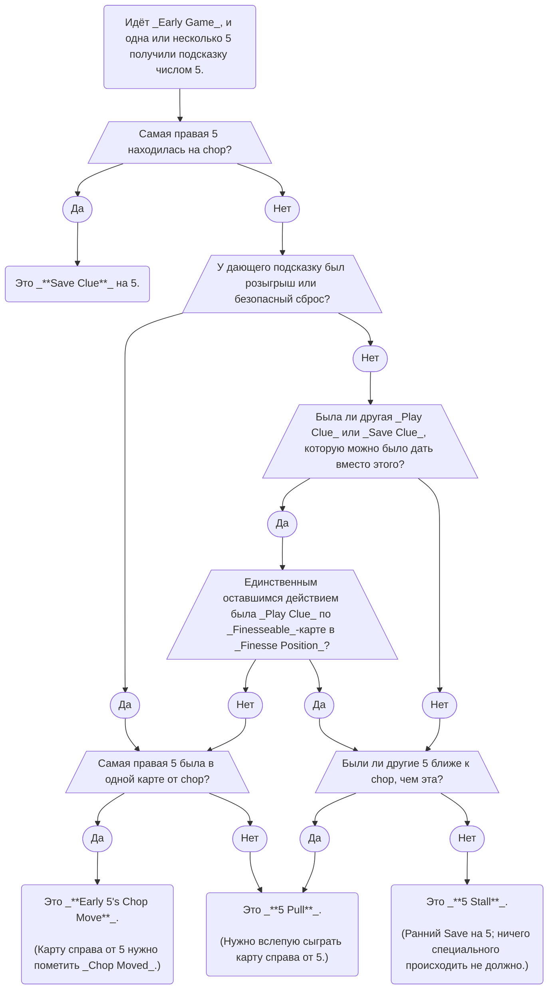

import RuL19DiagramTheFivePull from "./level-19/the-five-pull.yml";
import RuL19DiagramTheFivePullPrompt from "./level-19/the-five-pull-prompt.yml";
import RuL19DiagramTheFivePullDoubleFinesse from "./level-19/the-five-pull-double-finesse.yml";
import RuL19DiagramTheFivePullClandestineFinesse from "./level-19/the-five-pull-clandestine-finesse.yml";
import RuL19DiagramTheFivePullPromise from "./level-19/the-five-pull-promise.yml";
import RuL19DiagramTheFiveNumberEjection from "./level-19/the-five-number-ejection.yml";
import RuL19DiagramTheFiveNumberDischarge from "./level-19/the-five-number-discharge.yml";
import RuL19DiagramInteractionsBetween2SavesAnd5Stalls from "./level-19/interaction-between-2-saves-and-5-stalls.yml";

## Конвенции {/* #conventions */}

### Low Score Phase и Normal Score Phase {/* #the-low-score-phase-and-the-normal-score-phase */}

- К этому моменту вы уже должны знать, что мы делим партию Hanabi на _Early Game_ и _Mid-Game_ — в зависимости от того, когда кто-то впервые сбрасывает карту.
- Аналогичным образом мы делим партию на _Low Score Phase_ и _Normal Score Phase_:
  - _Low Score Phase_ (фаза низкого счёта) — это период, когда счёт меньше `2 × количество цветов`. (Например, меньше 10 очков в игре без варианта, меньше 6 очков в игре с тремя цветами и т. д.)
  - _Normal Score Phase_ (обычная фаза счёта) начинается, когда счёт достигает этого порога или превышает его.
- Некоторые специальные ходы с подсказкой числом 5 разрешены только во время _Low Score Phase_.
- На Hanab Live счёт окрашивается в голубой цвет, когда активна _Low Score Phase_.

### В Low Score Phase подсказка числом 5 не бывает прямой Play Clue {/* #no-play-clues-with-a-number-5-clue-in-the-low-score-phase */}

- Обычно, если игрок даёт подсказку числом 5 по 5, которая находится в двух или более картах от chop, и сам игрок не находится в Stalling Situation, это была бы _Play Clue_ на 5.
- Однако в _Low Score Phase_ **никакая** подсказка числом 5 не трактуется как прямая _Play Clue_.
- Вместо этого она означает более продвинутый ход. (См. раздел [_5 Pull_](#the-5-pull) ниже.)
- Поэтому, если игрокам нужно дать _Play Clue_ на играбельную 5, а счёт меньше 2 очков на цвет, они **обязаны** использовать цветовую подсказку или подождать до более позднего момента.

## Специальные ходы {/* #special-moves */}

### Early 5's Chop Move {/* #the-early-5s-chop-move */}

- Сначала см. раздел [_5 Stall_](./level-9.mdx#the-5-stall-intermediate-section).
- В _Early Game_ игрокам разрешено делать _5 Stall_ только если больше нечего делать. (Либо, как особое исключение, если доступна ровно одна _Play Clue_ и эта карта находится в _Finesse Position_.)
- Поэтому если кто-то подсказывает 5, когда **есть** что ещё сделать, он должен пытаться передать дополнительное сообщение.
- Если эта 5 находится в одной карте от chop, игрок намеревается сделать _Early 5's Chop Move_. Он работает точно так же, как обычный _5's Chop Move_, только выполняется в _Early Game_, где это обычно невозможно.
- Для игроков 21-го уровня существуют [дополнительные правила](/level-21#interaction-between-the-chop-move-ignition-and-5-rank-clues), связанные с _Early 5's Chop Move_.

### 5 Pull {/* #the-5-pull */}

- Эта конвенция применяется только в _Low Score Phase_.
- Игрокам разрешено делать _5 Stall_ только в определённых ситуациях. Если игрок делает _5 Stall_ там, где он был бы запрещён, то это вообще не _5 Stall_, а:
  - _5's Chop Move_, если 5 находится в одной карте от chop;
  - _Play Clue_, если 5 находится в двух или более картах от chop.
- Однако в _Low Score Phase_ _Play Clues_ через подсказку числом 5 не применяются, поэтому дающий подсказку должен иметь в виду что-то другое: _5 Pull_.
- _5 Pull_ заставляет игрока вслепую сыграть карту справа от 5. Сама подсказанная 5 не связана с blind-play. Именно поэтому ход называется _Pull_, а не _Finesse_ или _Bluff_.
- Обычно _5 Pull_ делают на 5 в слоте 1. Но, например, можно подсказать 5 в слоте 2, чтобы карта из слота 3 была сыграна вслепую.
- _5 Pull_ имеет приоритет над _Finesses_ и _Bluffs_, потому что подсказка числом 5 никогда не считается _Play Clue_.
- Например, в игре на троих:
  - Идёт _Early Game_ и _Low Score Phase_.
  - Красная 3 уже сыграна на стол.
  - В руке Боба есть зелёная 1 без подсказок.
  - Алиса даёт Кэти подсказку числом 5, затрагивая красную 5 в слоте 1. (У Алисы есть другие _Play Clues_, поэтому это не может быть _5 Stall_.)
  - Обычно Боб решил бы, что это _Finesse_ и ему нужно вслепую сыграть свою _Finesse Position_ как красную 4.
  - Однако Боб знает, что _Play Clues_ через подсказку числом 5 не применяются в _Low Score Phase_; значит, Алиса **не** утверждает, что красная 5 играбельна.
  - Боб видит справа от 5 играбельную синюю 1, поэтому Алиса должна иметь в виду _5 Pull_. Когда ход дойдёт до Кэти, Кэти вслепую сыграет эту карту.

<RuL19DiagramTheFivePull />

- Поскольку _5 Pull_ никогда не является _Play Clue_ на саму 5, через _5 Pull_ можно «вытянуть» 4, не обещая, что 5 того же цвета.
- Несколько сбивает с толку то, что _5 Pull_ работает иначе, чем _Finesse_. Хотя ход включает blind-play, _5 Pull_ нужно трактовать как _Delayed Play Clue_ (или потенциальный _Prompt_). Это значит, что _Pulled_-карта может ждать, пока сыграют любые уже затронутые карты.
- Если игрок _Finessed_ или _Bluffed_, ему разрешено отложить blind-play, чтобы выполнить собственный _Finesse_ или _Bluff_. Однако если игрок потенциально _Bluffed_, ему **не разрешено** начинать _5 Pull_. (При этом всё ещё разрешено отложить розыгрыш в _Finesse_, чтобы начать _5 Pull_.)
- В редком случае, когда в игре на троих _5 Pull_ делается подсказкой по двум 5 в слотах 1 и 3, _Pulled_-картой является слот 2.
- Помните: подсказка числом 5 [всегда является _5 Stall_, а не _5 Pull_, если единственная проигнорированная карта — 2 на chop](#interaction-between-2-saves--5-stalls).

### 5 Pull Prompt & 5 Pull Finesse {/* #the-5-pull-prompt--the-5-pull-finesse */}

- _5 Pull_ также может запускать _Prompt_ или _Finesse_.
- Например, в игре на четверых:
  - Это первый ход партии, на столе ещё ничего не сыграно.
  - Рука Кэти от новой карты к старой: `синяя 4, синяя 5, красная 2, красная 2`.
  - Рука Дональда от новой карты к старой: `жёлтая 4, зелёная 1, жёлтая 3, жёлтая 3`.
  - Алиса даёт Кэти подсказку числом 5, затрагивая синюю 5 в слоте 2.
  - Боб знает: поскольку идёт _Early Game_, подсказка Алисы могла бы быть _5 Stall_.
  - Но Боб также знает, что _5 Stall_ разрешён только когда нет обычных _Save Clues_ или _Play Clues_. Боб видит зелёную 1 Дональда, по которой можно дать _Play Clue_. Значит, подсказка Алисы не может быть _5 Stall_; раз 5 находится в двух или более картах от chop, это _5 Pull_.
  - Боб знает, что в таком _5 Pull_ _Pulled_-картой была бы красная 2. Если Боб ничего не сделает, Кэти может затем сделать мисплей красной 2 как какой-то играбельной 1.
  - Поэтому это должен быть _5 Pull Finesse_: Боб вслепую играет свою _Finesse Position_. Это красная 1, и её удаётся успешно разыграть.
  - Кэти знает, что единственная причина для blind-play Боба — _5 Pull Finesse_. Кэти вслепую играет карту из слота 3. Это красная 2, и её удаётся успешно разыграть.

<RuL19DiagramTheFivePullPrompt />

- В отличие от других видов _Finesse_, _5 Pull Finesse_ **обязан** быть продемонстрирован blind-play между моментом подсказки _5 Pull_ и следующим ходом _Pulled_-игрока (то есть быть _Forward Finesse_).
- Поэтому _5 Pull_ **не может** запускать _Reverse Finesse_. (Мы не хотим заставлять _Pulled_-игрока держать в голове слишком много вариантов.)
- Помните: во время _5 Pull Finesse_ _Pulled_-карта **всегда** соединяется с blind-play. Иными словами, _5 Pull Bluff_ не существует.

### 5 Pull Double Finesse {/* #the-5-pull-double-finesse */}

- Сначала см. раздел [_5 Pull Finesse_](#the-5-pull-prompt--the-5-pull-finesse).
- Как и можно ожидать, _5 Pull Double Finesse_ выполняется тем же способом, что обычный _5 Pull Finesse_.
- _Pulled_-карта всегда соединяется с последней blind-play.
- Например, в игре на четверых:
  - Это первый ход партии, на столе ещё ничего не сыграно.
  - Рука Дональда от новой карты к старой: `синяя 4, синяя 5, красная 3, жёлтая 1`.
  - Алиса даёт Дональду подсказку числом 5, затрагивая синюю 5 в слоте 2.
  - Боб вслепую играет красную 1, потому что знает: это не может быть _5 Stall_.
  - Кэти вслепую играет красную 2, потому что понимает, что должна сыграть в _Double Finesse_.
  - Дональд знает, что _Pulled_-карта — красная 3, соединяющаяся с красной 1 и красной 2.

<RuL19DiagramTheFivePullDoubleFinesse />

- Ранее мы сказали, что _5 Pull Finesse_ **обязан** быть _Forward Finesse_. Однако _Pulled_-игроки **должны** учитывать, что _5 Pull Finesse_ может быть _5 Pull Double Finesse_, где второй blind-play выполняется как _Reverse Finesse_. (Точнее, мы называем это _Finesse_ с компонентом _Reverse Finesse_.)
- Больше примеров _5 Pull Double Finesse_ можно найти [здесь](examples/5-pull-double-finesse.mdx).

### 5 Pull Clandestine Finesse {/* #the-5-pull-clandestine-finesse */}

- Сначала см. раздел [_5 Pull Finesse_](#the-5-pull-prompt--the-5-pull-finesse).
- _5 Pull Finesse_ **обязан** быть _Forward Finesse_.
- Однако _Pulled_-игроки **должны** учитывать, что этот _Finesse_ может быть _Clandestine_.
- Например, в игре на троих:
  - Это первый ход партии, на столе ещё ничего не сыграно.
  - Рука Боба от новой карты к старой: `красная 1, зелёная 1, зелёная 4, зелёная 4, зелёная 5`.
  - Рука Кэти от новой карты к старой: `синяя 4, синяя 1, синяя 5, зелёная 2, синяя 2`.
  - Алиса даёт Кэти подсказку числом 5, затрагивая синюю 5 в слоте 3.
  - Боб вслепую играет красную 1, потому что знает: это не может быть _5 Stall_.
  - Обычно Кэти решила бы, что Алиса сделала _5 Pull Finesse_, и вслепую сыграла бы карту из слота 4 как красную 2, соединяющуюся с красной 1.
  - Но Кэти также видит, что в момент подсказки за красной 1 у Боба была играбельная зелёная 1. Значит, Алиса могла делать _5 Pull Clandestine Finesse_.
  - Кэти делает нерелевантное действие.
  - Алиса делает нерелевантное действие.
  - Боб вслепую играет зелёную 1 из слота 2.
  - Теперь Кэти знает, что это действительно был _5 Pull Clandestine Finesse_ и в её слоте 4 находится зелёная 2.

<RuL19DiagramTheFivePullClandestineFinesse />

### 5 Pull Promise (Play Clue после 5 Pull) {/* #the-5-pull-promise-a-play-clue-after-a-5-pull */}

- Обычно _5 Pull_ приходится трактовать как _Delayed Play Clue_. Поэтому иногда _Pulled_-карта может ждать blind-play довольно долго.
- С точки зрения _Pulled_-игрока, если после этого даётся _Play Clue_ на карту, которая сейчас неиграбельна, интерпретацию _Delayed Play Clue_ можно отбросить: _Pulled_-игроку **обещана** карта, которая сделает эту неиграбельную карту играбельной.
- Например, в игре на четверых:
  - У Дональда две 1 с подсказками — красная 1 и синяя 1.
  - Алиса делает _5 Pull_ на Кэти. Кэти знает, что её _Pulled_-карта может быть красной 2 или синей 2, если это _Delayed Play Clue_.
  - Боб даёт Дональду подсказку по красной 3. Теперь Кэти знает, что ей **обещана** красная 2 как её _Pulled_-карта и ей больше не нужно ждать, пока сыграется синяя 1.

<RuL19DiagramTheFivePullPromise />

### Finesse для Pulled-игрока считаются Certain Finesses {/* #finesses-while-5-pulled-are-certain-finesses */}

- Иногда _Pulled_-игрок не играет _Pulled_-карту сразу. Возможно, сначала должны сыграть другие карты, либо игрок хочет использовать доступный _Finesse_, пока возможность не исчезла.
- Любой _Finesse_, который выполняет _Pulled_-игрок, нужно считать _Certain Finesse_.
- Любой _Certain Discard_, сделанный в ответ на _Finesse_, который инициировал _Pulled_-игрок, относится к его _Pulled_-карте.

### 5 Pull Skip {/* #the-5-pull-skip */}

- Если игрок уже _Finessed_, можно снова сделать на него _Finesse_ и заставить сыграть карту из _Second Finesse Position_.
- Аналогично, если выполняется _5 Pull_, а карта непосредственно справа от 5 уже имеет подсказку или уже «получена», _5 Pull_ пропускает эту карту и получает следующую после неё.

### 5 Number Ejection (5NE) {/* #the-5-number-ejection-5ne */}

- Эта конвенция применяется только в _Low Score Phase_.
- Игрокам разрешено делать _5 Stall_ только в определённых ситуациях. Если игрок даёт _5 Stall_ там, где он был бы запрещён, то на самом деле это:
  - _5's Chop Move_, если 5 находится в одной карте от chop;
  - _5 Pull_, если 5 находится в двух или более картах от chop, а карта справа играбельна;
  - _5 Pull Finesse_, если 5 находится в двух или более картах от chop, а карта справа _one-away-from-playable_.
- Но что, если 5 находится в двух или более картах от chop, а карта справа _two-or-more-away-from-playable_? Это было бы очень странно.
- Мы договариваемся считать это сигналом _Ejection_: следующий игрок должен сыграть свою _Second Finesse Position_.
- Например, в игре на троих:
  - Это первый ход, на столе ещё ничего не сыграно.
  - Алиса даёт Кэти подсказку числом 5, затрагивая 5 в слоте 1.
  - Рука Кэти от новой карты к старой: `красная 5, красная 3, зелёная 2, зелёная 1, зелёная 2`.
  - Боб размышляет, что может означать подсказка Алисы по 5:
    - Это не _5 Stall_, потому что зелёной 1 можно дать _Play Clue_.
    - Это не _5 Pull_, потому что красная 3 не играбельна.
    - Это не _5 Pull Finesse_, потому что красная 3 _two-away-from-playable_.
  - Поскольку для обычного _Finesse_ Бобу пришлось бы вслепую сыграть две карты — то же условие, что в _5 Color Ejection_, — Боб знает, что должен трактовать подсказку как _5 Number Ejection_. Боб вслепую играет карту из слота 2; это красная 1, и её удаётся успешно разыграть.
- После _5 Number Ejection_ карту рядом с 5 нужно пометить для всей команды как _Chop Moved_ и как _two-or-more-away-from-playable_. Например, в игре без варианта это всегда будет 3 или 4.

<RuL19DiagramTheFiveNumberEjection />

### 5 Number Discharge (5ND) {/* #the-5-number-discharge-5nd */}

- Эта конвенция применяется только в _Low Score Phase_.
- После _5 Pull_ в зависимости от играбельности _Pulled_-карты срабатывает обычный _5 Pull_, _5 Pull Finesse_ или _5 Number Ejection_.
- Но что, если карта вообще неиграбельна? Иными словами, что происходит, если _Pulled_-карта — мусор?
- Мы договариваемся считать это сигналом _Discharge_: следующий игрок должен сыграть свою _Third Finesse Position_.
- Например, в игре на троих:
  - Все 1 уже сыграны на стол.
  - Алиса даёт Кэти подсказку числом 5, затрагивая 5 в слоте 1.
  - Рука Кэти от новой карты к старой: `синяя 5, красная 1, зелёная 2, зелёная 4, жёлтая 1`.
  - Боб размышляет, что может означать подсказка Алисы по 5:
    - Это не _5 Stall_, потому что зелёной 2 можно дать _Play Clue_.
    - Это не _5 Pull_, потому что красная 1 не играбельна.
    - Это не _5 Pull Finesse_, потому что красная 1 не _one-away-from-playable_.
    - Это не _5 Number Ejection_, потому что красная 1 не _two-or-more-away-from-playable_.
  - Поэтому Боб знает, что это _5 Number Discharge_. Он вслепую играет свою _Third Finesse Position_. Там синяя 2, и её удаётся успешно разыграть.

<RuL19DiagramTheFiveNumberDischarge />

- После _5 Number Discharge_ карту рядом с 5 нужно пометить как мусор, известный всей команде.
  - Это означает, что карта считается имеющей положительную подсказку — например, как если бы её использовали для _Trash Chop Move_.
  - Поэтому _Finesse Position_ получателя подсказки должна переместиться на следующую карту без подсказки.

### 5 Number Ejection Finesse Position Skips {/* #the-5-number-ejection-finesse-position-skips */}

- Сначала см. разделы [_5 Number Ejection_](#the-5-number-ejection-5ne) и [_5 Number Discharge_](#the-5-number-discharge-5nd).
- После _5 Number Ejection_ карта рядом с 5 будет помечена как _Chop Moved_ и _two-or-more-away-from-playable_.
- Обычно _Chop Moved_-карты не находятся в _Finesse Position_, потому что лежат справа в руке. Но после _5 Number Ejection_ _Chop Moved_-карта со временем может оказаться на _Finesse Position_.
- Если в такой ситуации происходит _Finesse_, владелец _Chop Moved_-карты должен либо сыграть её, **либо** пропустить — в зависимости от ситуации:
  - Обычно нужно просто считать _Chop Moved_-карту находящейся в _Finesse Position_ и сыграть её.
  - Однако если _Finesse_ вызывает карту, которая в момент _5 Number Ejection_ не была _two-or-more-away-from-playable_, очевидно, _Chop Moved_-карта не может быть целью _Finesse_; тогда её нужно пропустить и сыграть следующую карту из _Finesse Position_.

## Общие принципы {/* #general-principles */}

### Блок-схема для подсказок по 5 {/* #a-flowchart-for-cluing-5s */}

- Отличить _5 Stall_ от _5 Pull_ иногда непросто. Ниже приведена блок-схема, которая пошагово показывает, как различать эти случаи:

### Взаимодействие 2 Saves и 5 Stalls {/* #interaction-between-2-saves--5-stalls */}

- Обычно игрокам разрешено делать _5 Stall_ только если больше нечего делать. Если есть другое полезное действие, подсказка числом 5 сигнализирует более продвинутый ход.
- Иногда игрок может получить _5 Stall_, когда:
  1. Другому игроку всё ещё нужно сделать _2 Save_.
  2. Этот _2 Save_ — единственная оставшаяся доступная подсказка.
- В такой ситуации игроки должны предполагать самое простое объяснение: _5 Stall_. Из-за [_Visible Rule_](./level-1.mdx#the-2-save) игрок, который дал _5 Stall_, не имел права делать _2 Save_, потому что видел вторую копию.
- В такой ситуации получатель _5 Stall_ должен записать на своей руке _Elimination Notes_ для другой копии этой 2. Более того, ему самому нельзя делать _2 Save_ второй копии, поэтому он должен дать другую подсказку или сбросить.
- Например, в игре на четверых:
  - Это первый ход, на столе ещё ничего не сыграно.
  - Алиса даёт Бобу подсказку числом 5, затрагивая 5 в слоте 1.
  - С точки зрения Боба у Алисы не было других _Play Clues_ или _Save Clues_, кроме возможного _2 Save_ красной 2 на chop Кэти.
  - Поэтому подсказка Алисы числом 5 может быть либо _5 Pull_, либо _5 Stall_ — в зависимости от того, находится ли другая копия красной 2 в руке Боба.
  - Боб знает, что в этой ситуации _5 Stalls_ имеют приоритет над _5 Pulls_, поэтому помечает свою руку для другой копии красной 2 и сбрасывает.

<RuL19DiagramInteractionsBetween2SavesAnd5Stalls />

---

## Тренировочные вопросы {/* #l19-training */}

В официальном источнике отдельного набора Official Challenge Questions для 19-го уровня нет; ниже — наши Training Questions по материалу этого уровня.

1. Когда заканчивается Low Score Phase?

_Low Score Phase_ продолжается, пока общий счёт меньше удвоенного числа цветов. Как только команда достигает этого порога, начинается _Normal Score Phase_. Например, в обычной игре с пятью цветами граница — 10 очков.

2. Как нужно понимать подсказку числом 5 в Low Score Phase?

В _Low Score Phase_ подсказка числом 5 никогда не означает прямую _Play Clue_ на саму 5. Если это не допустимый _5 Stall_ и не _5's Chop Move_, у подсказки должен быть специальный смысл — прежде всего _5 Pull_ или один из его вариантов.

3. Какую карту выбирает обычный 5 Pull?

_5 Pull_ заставляет сыграть вслепую карту сразу справа от подсказанной 5; сама 5 с этим blind-play не связана. Если ближайшая карта уже имеет подсказку или уже считается одной из карт, которые «даёт» другая подсказка, _5 Pull_ пропускает её и выбирает следующую карту справа.

4. Какие ограничения действуют для 5 Pull Finesse?

Между подсказкой _5 Pull_ и следующим ходом игрока с Pulled-картой обязательно должен произойти blind-play другого игрока. Поэтому обычный _5 Pull Finesse_ — это _Forward Finesse_, а не _Reverse Finesse_. Исключение — _5 Pull Double Finesse_: второй blind-play в нём может быть компонентом _Reverse Finesse_. Кроме того, Pulled-карта всегда соединяется с blind-play, поэтому _5 Pull Bluff_ не существует.

5. Чем 5 Number Ejection отличается от 5 Number Discharge?

Нужно посмотреть на карту справа от 5 — ту, которую обычный _5 Pull_ заставил бы сыграть вслепую. Если она _two-or-more-away-from-playable_, это _5 Number Ejection_, и следующий игрок разыгрывает _Second Finesse Position_. Если эта карта вообще мусор, это _5 Number Discharge_, и следующий игрок разыгрывает _Third Finesse Position_.

  6. Что происходит, если при подсказке 5 единственная пропущенная обычная
  подсказка — 2 Save?

Это специальное исключение: _5 Stall_ имеет приоритет над _5 Pull_. Получатель _5 Stall_ с помощью _Elimination Notes_ отмечает в своей руке возможную вторую копию этой 2 и не должен сам давать пропущенный _2 Save_.

