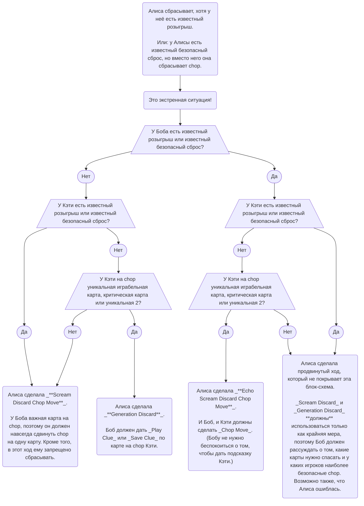

import RuL22DiagramCompositionDiscard from "./level-22/composition-discard.yml";
import RuL22DiagramRebelliousDiscard from "./level-22/rebellious-discard.yml";

## Конвенции {/* #conventions */}

### Phantom Playable Cards {/* #phantom-playable-cards */}

- Сначала см. раздел об [определении играбельных карт](./level-1.mdx#the-definition-of-playable).
- Чтобы карта считалась _delayed playable_, она должна стать играбельной «через» другие карты с подсказками или «через» карты на _Finesse Position_. Иными словами, _delayed playable_-картам разрешено давать _Play Clues_.
- Есть немного другая категория карт. Карта считается _Phantom Playable_, если она станет играбельной «через» карты, которые видны в чьей-то руке, но промежуточные карты ещё не находятся на _Finesse Position_ и не имеют подсказок. _Phantom Playable_-картам **нельзя** давать _Play Clues_ — по крайней мере до тех пор, пока сначала не будут подсказаны промежуточные карты.
- Из _Save Principle_ мы знаем, что команда договаривается не позволять сбрасывать _playable_ и _delayed playable_-карты.
- По возможности команда должна стараться защищать от сброса и _Phantom Playable_-карты: по важности они почти не уступают _delayed playable_. Например, часто другие игроки сбрасывают, чтобы именно владелец _Phantom Playable_-карты смог дать _Play Clue_ по промежуточной карте.
- Иногда _Phantom Playable_-карту всё же приходится сбросить, когда у команды мало жетонов подсказок или ситуация иным образом очень напряжённая. Это неприятно, но вполне допустимо и время от времени действительно происходит.

## Специальные ходы {/* #special-moves */}

### Scream Discard для Phantom Playable-карты {/* #the-scream-discard-for-a-phantom-playable-card */}

- Сначала см. раздел о [_Scream Discard_](./level-7.mdx#the-scream-discard-chop-move-sdcm) и раздел о [_Phantom Playable Cards_](#phantom-playable-cards).
- Обычно _Scream Discard_ разрешён только ради критической или играбельной карты. Но что делать с _Phantom Playable Card_?
- В большинстве случаев ради _Phantom Playable Card_ тоже следует сделать _Scream Discard_, но решение зависит от ситуации:
  - всем ли будет понятно, что происходит;
  - получат ли промежуточные карты подсказки сразу;
  - есть ли на chop другие критические карты, которые нужно спасти сейчас или вскоре;
  - является ли _Phantom Playable_-карта 3 или 4.
- В итоге в сложной или очень напряжённой ситуации лучше позволить _Phantom Playable_-карте сброситься, **особенно** если это 4.
- Иначе говоря, команде не следует «лезть из кожи вон» ради _Phantom Playable_-карты. Нужно помнить, что любой _Scream Discard_ несёт небольшой риск проиграть партию, если сама сброшенная через _Scream Discard_ карта окажется критической.

### Sacrifice Discard {/* #the-sacrifice-discard */}

- Сначала см. раздел о [_Scream Discard_](./level-7.mdx#the-scream-discard-chop-move-sdcm).
- Обычно нежелательно, чтобы рука игрока была _Locked_, но иногда это происходит. При этом одна из карт в Locked-руке может быть полезна в будущем, но не быть критической — то есть другая её копия находится в чьей-то руке или ещё остаётся в колоде.
- В нормальной ситуации карты с подсказками вообще не следует сбрасывать; такой сброс обычно означает _Sarcastic Discard_ или _Gentleman's Discard_. Но Locked-игрок может решить «пожертвовать» некритической картой из своей руки. В этой ситуации сброс **не** означает ни _Sarcastic Discard_, ни _Gentleman's Discard_.
- Когда Locked-игрок сбрасывает некритическую карту, это иногда _Generation Discard_, а иногда _Sacrifice Discard_. Остальным игрокам приходится определять интерпретацию по тому, насколько хорошо или плохо идёт партия. Обычно выбор очевиден: _Sacrifice Discard_ очень редок и применяется только в по-настоящему тяжёлых ситуациях.

### Echo Scream Discard Chop Move (ESDCM) {/* #the-echo-scream-discard-chop-move-esdcm */}

- Сначала см. раздел о [_Scream Discard_](./level-7.mdx#the-scream-discard-chop-move-sdcm).
- _Scream Discard Chop Move_ делается только как крайняя мера. Поэтому, если у следующего игрока на chop лежит неважная карта, такой сброс обычно является _Generation Discard_ и никого не делает _Chop Moved_.
- Но что, если после _Scream Discard_ у следующего игрока есть одно из следующего:
  - известная играбельная карта;
  - известный безопасный мусор для сброса.
- Поскольку _Scream Discard_ используется только как крайняя мера, у действия должен быть дополнительный смысл. Тогда оно делает _Chop Moved_ и следующего игрока, **и** игрока после него. Это называется _Echo Scream Discard_: сигнал как бы «отскакивает» от следующего игрока и идёт дальше как «двойной крик».
- Как и после обычного _Scream Discard_, все игроки, ставшие _Chop Moved_, не имеют права сбрасывать chop на своём следующем ходу.
- В маловероятном случае, когда **два** игрока подряд имеют известные розыгрыши или известные безопасные сбросы, _Echo Scream Discard_ «отскакивает» от обоих и в сумме вызывает **три** _Chop Moves_. Три таких игрока подряд дают четыре _Chop Moves_ и так далее.
- _Echo Scream Discard_ работает так же и в форме, когда у сбрасывающего есть известный безопасный мусор, но вместо него он сбрасывает chop.

### Echo Shout Discard (недопустимо) {/* #the-echo-shout-discard-illegal */}

- В отличие от _Scream Discard_, _Shout Discard_ не может вызывать _Echo Chop Moves_. Причина в том, что сброс известного мусора значительно менее серьёзен, чем намеренный сброс неизвестной карты с риском проиграть партию.
- Поэтому сброс известного мусора вместо розыгрыша всегда является либо одиночным _Shout Discard Chop Move_, либо _Generation Discard_.

### Composition Discard {/* #the-composition-discard */}

- Сначала см. разделы о [_Scream Discard_](./level-7.mdx#the-scream-discard-chop-move-sdcm) и [_Generation Discard_](./level-7.mdx#the-generation-discard).
- В редких случаях один и тот же сброс может одновременно быть _Scream Discard_ для одного игрока и _Generation Discard_ для другого.
- Например, в игре на четверых:
  - в банке 0 жетонов подсказок;
  - Алисе нужно заранее спланировать свой ход;
  - у Боба и Дональда на chop лежат критические карты, а у Кэти есть безопасный сброс;
  - у Алисы и Боба есть по одной известной играбельной карте;
  - если Алиса сыграет свою карту, Боб будет вынужден сделать _Generation Discard_ и сбросит критическую карту. Такой вариант недопустим;
  - поэтому Алиса должна сбросить. Для Боба это _Scream Discard_, и он должен сделать _Chop Move_. Для Кэти это одновременно _Generation Discard_, поэтому Кэти не должна делать _Chop Move_.

<RuL22DiagramCompositionDiscard />

### Rebellious Discard {/* #the-rebellious-discard */}

- Сначала см. раздел о [_Scream Discard_](./level-7.mdx#the-scream-discard-chop-move-sdcm).
- По правилам _Scream Discard_ следующий игрок после такого сброса **не может** сбрасывать. Если полезной подсказки нет, ему приходится полностью потратить жетон впустую.
- Однако иногда игрок, на которого «кричали», видит: если он даст подсказку, следующий игрок останется с 0 жетонов и будет вынужден сбросить критическую карту.
- В такой ситуации игрок должен как обычно сделать _Chop Move_, а затем сбросить свою новую chop-карту. Этот второй _Scream Discard_ называется _Rebellious Discard_, потому что игрок не выполняет то, что ему «велели».
- Например, в игре на троих:
  - красная 4 находится в сбросе;
  - доступно 0 жетонов подсказок;
  - у Алисы есть известная играбельная синяя 2;
  - у Боба на chop находится критическая красная 4. Играбельных карт у Боба нет;
  - рука Кэти _Locked_. Все карты Кэти критические, и ни одна из них сейчас не играбельна;
  - Алиса смотрит на будущие ходы и понимает: если она сыграет синюю 2, Боб будет вынужден сбросить критическую красную 4, потому что у команды сейчас 0 жетонов;
  - поэтому Алиса делает _Scream Discard_: вместо розыгрыша известной играбельной синей 2 она сбрасывает карту;
  - Боб понимает, что Алиса сделала _Scream Discard_, и помечает свою chop-карту как _Chop Moved_;
  - Боб также знает, что по правилам _Scream Discard_ на этом ходу он не имеет права сбрасывать и должен дать какую-нибудь подсказку — это защищает случай, когда подряд лежат две критические карты;
  - но здесь, если Боб даст подсказку, он потратит последний жетон, после чего Кэти останется без подсказки и будет вынуждена сбросить критическую карту;
  - значит, Боб должен сделать _Rebellious Discard_, чтобы вернуть жетон и дать Кэти возможность выполнить другое действие.

<RuL22DiagramRebelliousDiscard />

## Общие принципы {/* #general-principles */}

### Блок-схема Scream Discard {/* #a-scream-discard-flowchart */}

Ниже приведена блок-схема, которая помогает определить, является ли сброс _Scream Discard Chop Move_ или _Generation Discard_:

---

## Тренировочные вопросы {/* #l22-training */}

В официальном источнике отдельного набора Official Challenge Questions для Level 22 нет; ниже — наши Training Questions по материалу этого уровня.

1. Чем Phantom Playable отличается от delayed playable?

_Delayed playable_ соединяется через уже подсказанные карты или карты на _Finesse Position_, поэтому по ней можно дать _Play Clue_. _Phantom Playable_ соединяется через видимые, но ещё неподсказанные и не находящиеся на Finesse Position промежуточные карты, поэтому прямую Play Clue ей пока давать нельзя.

  2. Нужно ли любой ценой делать Scream Discard ради Phantom Playable-карты?

Нет. Обычно её стоит защищать, но в сложной или тесной ситуации безопаснее позволить ей сброситься, особенно если это 4. Команда не должна чрезмерно рисковать ради Phantom Playable.

  3. Когда сброс подсказанной некритической карты может быть Sacrifice Discard?

Когда рука игрока _Locked_ и ситуация действительно тяжёлая. Такой сброс не обязан означать Sarcastic или Gentleman's Discard; команда отличает Sacrifice от Generation Discard по контексту.

  4. Что заставляет Scream Discard «отскочить» как Echo Scream Discard?

Если следующий игрок уже имеет известный розыгрыш или известный безопасный сброс, обычный Scream на него был бы бессмыслен как крайняя мера. Тогда Chop Move распространяется ещё на следующего игрока; цепочка может продолжаться дальше.

5. Может ли Shout Discard вызвать Echo Chop Moves?

Нет. Сброс известного мусора недостаточно серьёзен для такого сигнала. Это либо одиночный Shout Discard Chop Move, либо Generation Discard.

6. Что такое Composition Discard?

Один сброс одновременно несёт два разных сообщения: для одного игрока он является Scream Discard и требует Chop Move, а для другого — Generation Discard и, наоборот, не требует Chop Move.

  7. Почему Rebellious Discard нарушает обычное правило Scream Discard?

После Scream Discard следующий игрок обычно не имеет права сбрасывать. Но если трата последнего жетона подсказки вынудит следующего игрока сбросить критическую карту, он сначала делает положенный Chop Move, а затем сам сбрасывает новую chop-карту, возвращая команде жетон.

