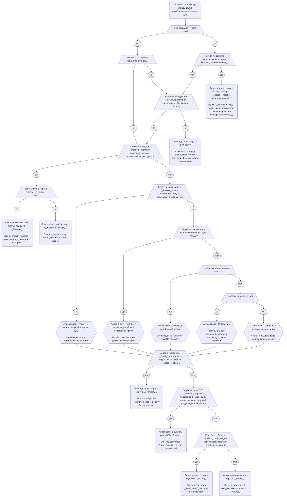

import RuL25DiagramPriorityPrompt from "./level-25/priority-prompt.yml";
import RuL25DiagramPriorityFinesse from "./level-25/priority-finesse.yml";
import RuL25DiagramPriorityBluff from "./level-25/priority-bluff.yml";
import RuL25DiagramLoadClue from "./level-25/load-clue.yml";
import RuL25DiagramTrustFinesse from "./level-25/trust-finesse.yml";
import RuL25DiagramPriorityFinesseSpecial from "./level-25/priority-finesse-special.yml";
import RuL25DiagramPriorityFinesseSpecial2 from "./level-25/priority-finesse-special-2.yml";
import RuL25DiagramPriorityIntoSomeoneElsesHand from "./level-25/priority-into-someone-elses-hand.yml";
import RuL25LocalImportant2Save from "./level-25/local-important-2-save.yml";

- Этот уровень вводит Приоритет (_Priority_) — систему, в которой игроки должны следить за порядком розыгрыша карт.
- К _Priority_ бывает непросто привыкнуть: сигналы, передаваемые порядком розыгрыша, легко пропустить.
- Прежде чем добавлять _Priority_ к остальным конвенциям, убедитесь, что предыдущие уровни уже не вызывают затруднений.

## Специальные ходы {/* #special-moves */}

### Priority Prompt и Priority Finesse {/* #the-priority-prompt--the-priority-finesse */}

- Обычно у игрока в конкретный момент есть только одна карта, которую нужно сыграть. Тогда, если нет какой-то особенно хорошей подсказки, выбирать нечего — игрок просто разыгрывает единственную играбельную карту.
- Но что делать, если играбельных карт две или больше? Какую разыгрывать первой?
- Если одна из карт ещё известна не полностью — например, это играбельная 2 неизвестного цвета, — игрок может захотеть сыграть её первой, чтобы узнать точное значение. В общем случае **розыгрыш неизвестной карты не запускает ничего особенного**.
- А вот розыгрыш полностью известной карты **может** передавать специальный сигнал: игрок точно знал, что делает. Мы договариваемся, что **играбельные карты следует разыгрывать в определённом порядке**. Этот порядок называется _Priority_:

<table className="l25-priority-table">
  <thead>
    <tr>
      <th>Priority</th>
      <th>Категория карты</th>
      <th>Почему</th>
      <th>Можно сделать другое?</th>
    </tr>
  </thead>
  <tbody>
    <tr>
      <td>1</td>
      <td>Blind-play</td>
      <td>
        Очень важно показать команде, что произошёл <em>Finesse</em> или{" "}
        <em>Bluff</em>.
      </td>
      <td>❌</td>
    </tr>
    <tr>
      <td>2</td>
      <td>Карты, которые ведут в подсказанные карты в чужой руке</td>
      <td>
        Иначе команда потеряет <em>Tempo</em>.
      </td>
      <td>✔️</td>
    </tr>
    <tr>
      <td>3</td>
      <td>Карты, которые ведут в собственную руку игрока</td>
      <td>
        Плохо, когда продвижение цвета надолго «застревает» у одного игрока.
      </td>
      <td>✔️</td>
    </tr>
    <tr>
      <td>4</td>
      <td>5</td>
      <td>Розыгрыш 5 возвращает команде бесплатный жетон подсказки.</td>
      <td>✔️</td>
    </tr>
    <tr>
      <td>5</td>
      <td>Карта меньшего ранга</td>
      <td>В первую очередь важно продвигать более низкие стопки.</td>
      <td>✔️</td>
    </tr>
    <tr>
      <td>6</td>
      <td>Самая левая карта</td>
      <td>У самой левой карты выше вероятность оказаться хорошей.</td>
      <td>✔️</td>
    </tr>
    <tr>
      <td>*</td>
      <td>Неизвестная карта</td>
      <td>
        Розыгрыш неизвестных карт помогает узнать больше о собственной руке. У
        неизвестной карты нет отдельного уровня <em>Priority</em>: таблицу нужно
        [применить к каждому возможному точному
        значению](#priority-with-both-known-and-unknown-cards).{" "}
        <strong>Напоминание:</strong> розыгрыш неизвестной карты [почти
        никогда](#the-trust-finesse-a-priority-finesse-from-playing-an-unknown-card)
        не запускает <em>Priority</em>.
      </td>
      <td></td>
    </tr>
  </tbody>
</table>

- Если игрок разыгрывает полностью известную карту, у которой **нет** _Priority_, значит он пытается передать специальное сообщение.
- Если исходя из сыгранной карты у вас есть одна или несколько подсказанных карт, совпадающих со следующей связующей картой, это сообщение означает: такую карту можно сыграть прямо сейчас как _Priority Prompt_. Он похож на обычный _Prompt_, только запускается не подсказкой, а порядком, в котором другой игрок разыграл свои карты.
- Например, в игре на троих:
  - у Алисы в руке есть подсказанная и точно известная играбельная красная 1 и подсказанная и точно известная играбельная синяя 2. У Боба есть две 3 с подсказками;
  - Алиса играет синюю 2;
  - следующим ходит Боб. Он знает, что при обычном выборе Алиса должна была сыграть карту меньшего ранга — красную 1, если только другая карта не была blind-play, не вела в чью-то руку или не являлась 5. Алиса **не сыграла карту с _Priority_**;
  - Боб не видит синюю 3 в руке Кэти. Значит, это _Priority Prompt_. Боб играет самую левую 3 с подсказкой, и она оказывается синей 3.

<RuL25DiagramPriorityPrompt />

- Как и при обычном _Prompt_, если _Priority Prompt_ может относиться к двум или более подсказанным картам, разыгрывается самая левая.
- Как и при обычном _Prompt_, если _Priority Prompt_ заставил сыграть самую левую карту, но она оказалась не связующей, нужно продолжать разыгрывать подсказанные карты, пока не найдётся связующая.
- Если же в вашей руке нет подсказанных карт, которые соединяются с только что сыгранной картой, нужно сыграть свою _Finesse Position_ как _Priority Finesse_.
- Например, в игре на троих:
  - у Алисы есть подсказанная и точно известная играбельная красная 1 и подсказанная и точно известная играбельная синяя 2;
  - Алиса играет синюю 2;
  - следующим ходит Боб. Он знает, что при выборе между двумя картами обычно нужно сыграть карту меньшего ранга, если только другая не является blind-play и т. п. Поэтому Алиса должна была сыграть красную 1, а не синюю 2. Алиса **не сыграла карту с _Priority_**;
  - Боб видит синюю 3 на _Finesse Position_ Кэти. Значит, Алиса сделала _Priority Finesse_ на Кэти, а не на Боба. Боб делает нерелевантное действие;
  - Кэти вслепую играет свою _Finesse Position_. Там синяя 3.

<RuL25DiagramPriorityFinesse />

### Priority Bluff {/* #the-priority-bluff */}

- Как и обычный _Bluff_, порядок _Priority_ можно использовать для _Priority Bluff_.
- Например, в игре на троих:
  - у Алисы есть известная играбельная красная 1 и известная играбельная синяя 2;
  - Алиса играет синюю 2;
  - следующим ходит Боб. Он знает, что при выборе между двумя картами обычно разыгрывается карта меньшего ранга, если только другая не является blind-play, не ведёт в чью-то руку или не является 5. Боб не видит ни одной синей 3 и поэтому знает, что Алиса должна была сыграть красную 1 вместо синей 2. Алиса **не сыграла карту с _Priority_**;
  - значит, у Боба должна быть синяя 3. Подсказанных карт у него нет, поэтому он вслепую играет свою _Finesse Position_. Это **не** синяя 3, а зелёная 1. Теперь Боб понимает, что это был _Bluff_, а синей 3 ни у кого нет.

<RuL25DiagramPriorityBluff />

### Layered Priority Finesse {/* #the-layered-priority-finesse */}

- Как и обычный _Layered Finesse_, можно запустить _Layered Priority Finesse_, если игрок, который должен делать blind-play, не является самым следующим игроком.

### Load Clue {/* #the-load-clue */}

- Сначала см. раздел о [Priority Prompt и Priority Finesse](#the-priority-prompt--the-priority-finesse).
- В Hanabi выгодно разыгрывать карты, которые ведут в руки партнёров: это даёт _Tempo_ и уменьшает риск bottom-deck. _Priority_ оптимизирован для частного случая, когда следующая карта лежит у кого-то на _Finesse Position_. Но гораздо чаще следующая карта находится в другом слоте. Поэтому у игры с _Priority_ есть серьёзный недостаток: нельзя просто разыгрывать карты, ведущие в чужие карты вне Finesse Position, иначе кто-то сделает мисплей.
- Поэтому мы договариваемся: если следующая карта видна в чужой руке вне _Finesse Position_, _Priority Finesse_ не применяется, и команда обязуется дать этой карте прямую подсказку.
- Такая подсказка похожа на _Fix Clue_, потому что предотвращает надвигающийся мисплей в ситуации, которая выглядела как _Priority Finesse_. Но мы называем её _Load Clue_, чтобы отличать от _Fix Clue_, исправляющей _Lie_ или ошибку. Она «загружает» получателя конкретным действием на его ход.
- Например, в игре на троих:
  - на столе сыграны красная 1 и синяя 1;
  - Алиса выбирает между известной красной 2 и известной синей 2. Красная 2 имеет _Priority_, потому что находится левее;
  - Алиса играет синюю 2;
  - Боб видит руку Кэти от самой новой карты к самой старой: `жёлтая 4, жёлтая 3, жёлтая 4, красная 1, синяя 3`;
  - Боб видит, что Кэти решит, будто Алиса сделала _Priority Finesse_ на синюю 3. Поэтому Боб обязан дать _Load Clue_, чтобы остановить надвигающийся мисплей;
  - Боб даёт Кэти подсказку числом 3;
  - Кэти удивлена: она собиралась сыграть свою _Finesse Position_ как синюю 3, но теперь знает, что эта карта не может быть синей 3;
  - если бы это была _Fix Clue_, Кэти могла бы решить сыграть затронутую карту, ближайшую к слоту 1 — 3 в слоте 2;
  - но _Load Clue_ трактуется как обычная _Play Clue_, а не как _Fix Clue_. Поэтому Кэти применяет обычный _Chop-Focus Play Clue_ и играет синюю 3 из слота 5.

<RuL25DiagramLoadClue />

- Получив _Load Clue_, игрок трактует её как обычную _Play Clue_, а не как _Fix Clue_.
- Подсказка остаётся _Load Clue_, даже если без контекста выглядела бы как _Save Clue_. Иными словами, карта, обещанная Priority-ходом, обязана находиться **где-то**.
- _Load Clue_ уникальна тем, что это единственный ход, нарушающий [_Information Lock Principle_](./level-3.mdx#information-lock-principle). Когда игрок понимает, что получил _Load Clue_, он должен мысленно вернуться к моменту Priority-хода, удалить все заметки, связанные с _Priority_, и заново интерпретировать подсказку с нуля.
- Получив _Load Clue_, стоит подозревать ценную карту на собственном chop: это была бы отличная причина заранее обязать команду дать такую подсказку.
- Если игрок выбирает между картой, которая никуда не ведёт, и картой, которая обязывает команду дать _Load Clue_, ни один вариант не является обязательным: можно выбрать тот, который лучше подходит к текущей ситуации.

### Paused Priority Finesse {/* #the-paused-priority-finesse */}

- В рамках _Priority_ blind-play — самое важное действие. Если игрок должен сыграть карту вслепую, обычно ему **нельзя** делать _Priority Finesse_: нужно продолжить исходный blind-play.
- Исключение возникает во время раскрытия слоя _Layered Finesse_. Если игрок уже сыграл первую карту слоя вслепую, он доказал команде, что Finesse действительно был на нём, и теперь вся команда знает, что розыгрыш остальных карт внутри слоя уже гарантирован.
- Поэтому игрок может «поставить на паузу» завершение _Layered Finesse_ и сыграть другую подсказанную карту, чтобы сделать _Priority Finesse_. Это называется _Paused Priority Finesse_.
- Это работает только тогда, когда сделанный blind-play не был связан с исходным _Layered Finesse_:
  - например, если игрок находится под Finesse одновременно на красную 1 и красную 2 и только что вслепую сыграл зелёную 1, он может сделать _Priority Finesse_: команда понимает, что зелёная 1 сыграла как красная 1 и слой ещё не раскрыт до конца;
  - но если игрок находится под Finesse на красную 1 и красную 2 и только что вслепую сыграл именно красную 1, он **не может** делать _Paused Priority Finesse_: команда ещё не получила доказательства, что он всё ещё находится под Finesse на красную 2.

### Trust Finesse — Priority Finesse после розыгрыша неизвестной карты {/* #the-trust-finesse-a-priority-finesse-from-playing-an-unknown-card */}

- По обычным правилам _Priority_, если сыграна неизвестная карта, _Priority Finesse_ не запускается.
- Однако если розыгрыш одной карты вместо другой был бы **крайне** субоптимальным, он всё же должен запускать _Finesse_.
- Такой ход называется _Trust Finesse_, чтобы отличать его от случая с картой, точное значение которой известно всей команде.
- Аналогично возможны _Trust Prompt_, _Trust Bluff_ и другие варианты.
- Например, в игре на троих:
  - все 1 уже сыграны на стол;
  - у Алисы в руке две играбельные карты:
    - на одной есть красная подсказка. Изначально её подсказали как _Play Clue_, поэтому вся команда знает, что это красная 2;
    - на другой есть подсказка числом 2. Изначально она была подсказана через _Save Clue_, поэтому может быть любой некрасной 2. Но сейчас она играбельна, потому что все 1 уже сыграны;
  - у Боба есть подсказанная красная 3, точное значение которой известно всей команде;
  - Алиса знает, что от неё ожидают розыгрыш красной 2 в красную 3 Боба: это нормальная командная игра;
  - при этом только Алиса из контекста партии знает, что её неопределённая 2 на самом деле должна быть синей 2;
  - у Боба синяя 3 находится на _Finesse Position_;
  - Алиса играет 2, точное значение которой остальной команде неизвестно, и тем самым запускает _Trust Finesse_.

<RuL25DiagramTrustFinesse />

## Другие конвенции, связанные с Priority {/* #other-priority-related-conventions */}

### Блок-схема Priority — выбор между двумя или более играбельными картами {/* #a-priority-flowchart-for-choosing-between-2-playable-cards */}

_Priority_ может быть запутанным. Ниже приведена общая блок-схема выбора карты, когда у игрока есть две играбельные карты:

### Priority и blind-play {/* #priority-with-blind-plays */}

Как сказано выше, blind-play имеет высший Priority, потому что крайне важно продемонстрировать команде произошедший _Finesse_ или _Bluff_. Однако карта с заметкой о точном значении не считается «blind-play» для целей _Priority_. В частности:

- после _Gentleman's Discard_ или _Baton Discard_ на второй копии карты появляется заметка с точным значением. Для _Priority_ такая карта считается «подсказанной»;
- когда _Elimination Notes_ исключены со всех карт, кроме одной, на последней карте появляется заметка с точным значением. Для _Priority_ она также считается «подсказанной».

### Priority при одновременных известных и неизвестных картах {/* #priority-with-both-known-and-unknown-cards */}

- Напомним: если у игрока есть две играбельные карты и обе полностью известны, у него всегда есть возможность передать сигнал _Priority_.
- Если из двух играбельных карт полностью известна только одна, розыгрыш неизвестной карты никогда сам по себе не запускает _Priority_.
- Но что происходит, если игрок выбирает полностью известную карту вместо неизвестной? _Priority_ **может** сработать, но **только** если сыгранная карта имеет более низкий Priority, чем **каждое** возможное точное значение неизвестной карты.
- Например, в игре на троих:
  - на столе сыграна красная 2; во всех остальных цветах сыграны 1;
  - у Алисы есть красная 3, точное значение которой известно всей команде;
  - у Алисы есть 2 неизвестного цвета: по _Good Touch Principle_ это может быть синяя, зелёная, жёлтая или фиолетовая 2;
  - у остальных игроков нет подсказанных карт;
  - Алиса знает, что красная 3 имеет более низкий _Priority_, чем **все** возможные варианты этой 2, потому что любой вариант 2 имеет меньший ранг;
  - Алиса играет красную 3 и запускает _Priority Finesse_ на красную 4.

<RuL25DiagramPriorityFinesseSpecial />

- Например, в игре на троих с радужным цветом:
  - на столе сыграны красная 2 и радужная 2; во всех остальных цветах сыграны 1;
  - у Алисы есть красная 3, точное значение которой известно всей команде;
  - у Алисы есть играбельная синяя карта неизвестного ранга. Это может быть синяя 2 или радужная 3;
  - Алиса знает, что красная 3 имеет более низкий _Priority_, чем синяя 2, но более высокий _Priority_, чем радужная 3, потому что красная 3 находится левее;
  - у остальных игроков нет подсказанных карт;
  - Алиса играет красную 3. _Priority Finesse_ **не** запускается, потому что возможные значения неизвестной карты имеют разный Priority относительно красной 3.

<RuL25DiagramPriorityFinesseSpecial2 />

### Ситуации, где Priority не применяется {/* #situations-where-priority-does-not-apply */}

_Priority_ действует не всегда. Ниже перечислены распространённые исключения.

#### 1) _End-Game_ {/* #1-end-game */}

- В _End-Game_ _Priority_ обычно **не применяется**, потому что игрокам часто необходимо разыгрывать конкретные карты.
- Тем не менее _Priority_ всё ещё может передать сигнал, если выбранный игроком порядок иначе был бы явно ужасен для команды.

#### 2) 4's Priority Exception {/* #2-the-4s-priority-exception */}

- Если у игрока есть известная играбельная 5 и известная играбельная 4, ведущая в его собственную руку, таблица выше дала бы Priority 4. Но это не очень разумно: 5 всё равно придётся сыграть, её розыгрыш возвращает жетон подсказки, 4 можно распределить другому игроку и т. д.
- Поэтому, если у игрока одновременно есть известная играбельная 5 и известная играбельная 4, ведущая в собственную руку, считается, что _Priority_ имеет 5.
- _4's Priority Exception_ применяется также к 3 в редком случае, когда в одной руке одновременно находятся 3, 4 и 5 одного цвета.

#### 3) Blind-play карты, уже полностью известной команде {/* #3-blind-playing-globally-known-cards */}

- Обычно blind-play имеет _Priority_ над всем остальным.
- Но в некоторых продвинутых ситуациях blind-play уже не нужно демонстрировать команде: все и так полностью понимают происходящее. Тогда для определения _Priority_ такую карту следует считать подсказанной. Основной пример — _Gentleman's Discard_.

#### 4) «Важные» карты {/* #4-important-cards */}

- Обычно карты одного ранга разыгрываются слева направо.
- Но иногда команда знает, что **другая** карта **важнее** самой левой. Розыгрыш такой «более важной» карты никогда не должен запускать _Priority Finesse_ в стиле «справа налево».
- Например, в игре на троих:
  - в _Early Game_ Алиса даёт Бобу подсказку числом 2, затрагивая три 2 в слотах 3, 4 и 5 — последний является chop. Это конвенция _2 Save_;
  - позже все 1 уже сыграны на стол;
  - с тех пор Боб не получал других подсказок: все его 2 теперь известны как играбельные, но он не знает их цветов;
  - обычно Боб должен разыгрывать 2 слева направо. Но он также знает, что 2 в слоте 5 важнее остальных: именно она была фокусом исходного _2 Save_ Алисы;
  - поэтому Боб сначала играет 2 из слота 5, а затем возвращается к обычному порядку слева направо.

<RuL25LocalImportant2Save />

_Локальная иллюстрация по тексту примера; не официальный YML H-Group._

### Розыгрыш в руку другого игрока {/* #playing-into-someone-elses-hand */}

- При определении того, какая карта «ведёт» в чужую руку, для простоты учитывается только **самая следующая** карта в цепочке.
- Например, в игре на троих:
  - у Алисы есть синяя 3, красная 3 и красная 4, точные значения которых известны всей команде;
  - у Боба есть синяя 4, точное значение которой известно всей команде;
  - у Кэти есть красная 5, точное значение которой известно всей команде;
  - Алиса знает, что при выборе розыгрыша в чужие руки нужно учитывать только непосредственно следующую карту;
  - поэтому Алиса играет синюю 3 в синюю 4 Боба.

<RuL25DiagramPriorityIntoSomeoneElsesHand />

- Очевидное исключение — Locked-игрок в команде. Тогда лучше работать на то, чтобы разблокировать именно его.

---

## Тренировочные вопросы {/* #l25-training */}

Локальные вопросы для закрепления Level 25. Это не официальный набор Challenge Questions H-Group; ответы помечены отдельно, чтобы crawler глобального поиска мог исключать их из индекса.

  1. У Алисы две полностью известные играбельные карты. Что означает розыгрыш
  карты с более низким Priority?

Если обычные исключения не применяются, Алиса намеренно отказывается от карты с Priority и тем самым передаёт специальный сигнал. Следующий игрок проверяет Priority Prompt, Priority Finesse и, если подходит контекст, Priority Bluff.

  2. После Priority-хода у Боба есть подходящая подсказанная связующая карта.
  Что он делает?

Он разыгрывает её как Priority Prompt. Если подходят несколько подсказанных карт, выбирается самая левая; если она не оказалась связующей, Боб продолжает по подсказанным картам до связующей.

  3. После Priority-хода Кэти собирается сыграть Finesse Position, но Боб видит
  нужную связующую карту у неё в другом слоте. Что обязан сделать Боб?

Дать этой карте Load Clue и тем самым остановить ложный Priority Finesse. Кэти трактует Load Clue как обычную Play Clue и переинтерпретирует связанные с Priority заметки.

  4. Когда игрок под Layered Finesse может временно отложить продолжение слоя и
  сделать Priority Finesse?

Только после blind-play, который уже доказал команде наличие слоя, но сам не был очередной связующей картой исходного Layered Finesse. Если сыграна именно следующая карта слоя, пауза не разрешена.

  5. Может ли неизвестная карта запустить Priority?

Обычно нет. Исключение — Trust Finesse и родственные случаи, когда выбранный порядок был бы настолько субоптимален, что команда обязана прочитать его как специальный сигнал.

  6. Алиса играет полностью известную карту вместо неизвестной. Когда это
  всё-таки может запустить Priority?

Только если сыгранная карта имеет более низкий Priority, чем каждое возможное точное значение неизвестной карты. Если варианты суперпозиции дают смешанный порядок Priority, специальный сигнал не возникает.

7. В End-Game Priority полностью исчезает?

Обычно Priority там не применяется, потому что порядок розыгрышей диктуется эндшпилем. Но крайне неестественный для команды выбор всё ещё может передать Priority-сигнал.

  8. Алиса может сыграть в несколько чужих карт через длинные цепочки. Что
  учитывается при Priority «в чужую руку»?

Для простоты учитывается только непосредственно следующая карта в цепочке. Отдельное очевидное исключение — Locked-игрок: приоритетнее работать на его разблокировку.

